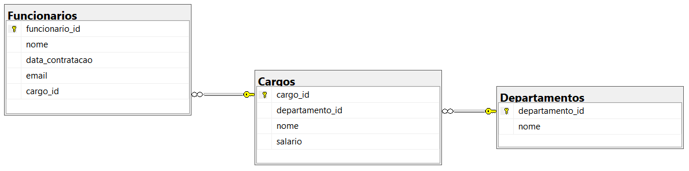
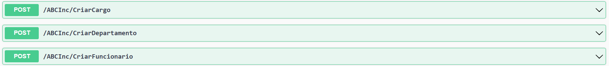
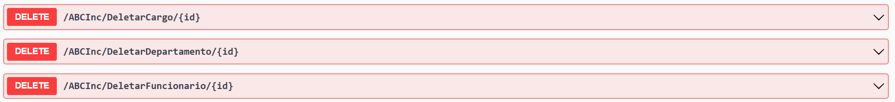
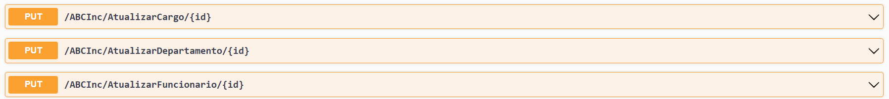
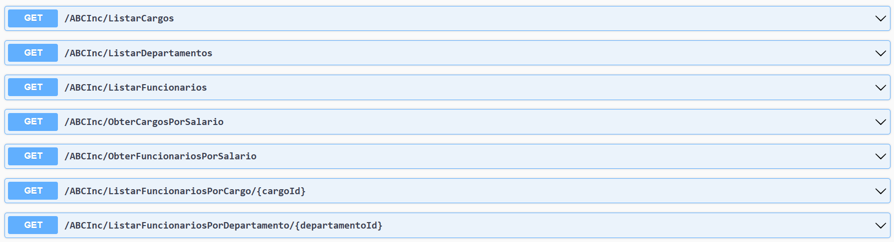

# Sistema Gerenciador Empresarial

Projeto desenvolvido para uso de conhecimentos adquiridos sobre API e SQL.

## Contexto
Sistema gerenciador empresarial, possibilita a gestão de funcionários, cargos e departamentos de uma empresa onde o usuário poderá cadastrar e manipular uma serie de informações via API com integração com DB (SQLServer).

Aplicação do tipo Web API com CRUD, permite o usuário obter os registros, criar, salvar e deletar esses registros.

Diagrama de relacionamento do DB:



## API

**Swagger**

Métodos de Criação

Métodos de Delete

Métodos de Atualização

Métodos de Listagem



**Endpoints**

| Verbo  | Endpoint                          |    Parâmetro   | Body          |
|--------|-----------------------------------|----------------|---------------|
| POST   | /CriarCargo                       | N/A            | Schema Tarefa |
| POST   | /CriarDepartamento                | N/A            | Schema Tarefa |
| POST   | /CriarFuncionario                 | N/A            | Schema Tarefa |
| DELETE | /DeletarCargo/{id}                | id             | N/A           |
| DELETE | /DeletarDepartamento/{id}         | id             | N/A           |
| DELETE | /DeletarFuncionario/{id}          | id             | N/A           |
| PUT    | /AtualizarCargo/{id}              | id             | Schema Tarefa |
| PUT    | /AtulaizarDepartamento/{id}       | id             | Schema Tarefa |
| PUT    | /AtualizarFuncionario/{id}        | id             | Schema Tarefa |
| GET    | /ListarCargos                     | N/A            | N/A           |
| GET    | /ListarDepartamentos              | N/A            | N/A           |
| GET    | /ListarFuncionarios               | N/A            | N/A           |
| GET    | /ObterCargosPorSalario            | int            | N/A           |
| GET    | /ObterFuncionariosPorSalario      | int            | N/A           |
| GET    | /ObterFuncionariosPorCargo        | cargoId        | N/A           |
| GET    | /ObterFuncionariosPorDepartamento | departamentoId | N/A           |


**Esse é o schema (model), utilizado para passar para os métodos que exigirem:**

Cargo:
```json
{
  "cargoId": 0,
  "departamentoId": 0,
  "nome": "string",
  "salario": 0
}
```

Departamento:
```json
{
  "departamentoId": 0,
  "nome": "string"
}
```

Funcionário:
```json
{
  "funcionarioId": 0,
  "nome": "string",
  "dataContratacao": "2023-11-23T15:38:56.841Z",
  "email": "string",
  "cargoId": 0
}
```